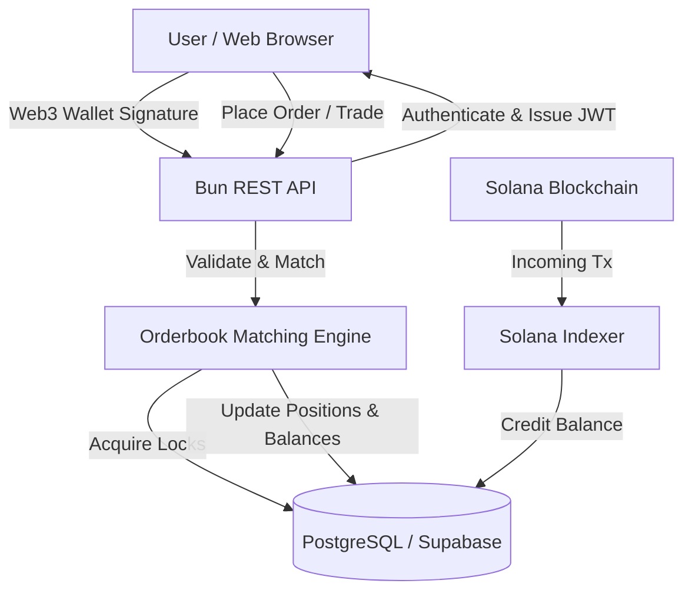

# PredictX System Architecture

PredictX utilizes a hybrid custodial architecture combining off-chain orderbook matching with on-chain Solana settlements.

## High-Level Component Layout

```text
prediction-market/
├── apps/
│   ├── api/                 # REST API server (Bun.serve)
│   └── indexer/             # Solana deposit listener daemon
├── packages/
│   ├── db/                  # Drizzle schemas, migrations, seed scripts
│   └── orderbook/           # Core matching engine & concurrency locks
└── servers/
    ├── accounts-server/     # Custom MCP server for synthetic account portfolios
    ├── market-server/       # Yahoo Finance quotes MCP server
    └── push-server/         # Pushover notification dispatch MCP server
```

## Data Flows



## Orderbook Matching Mechanics

1. **Direct Matches:**
   - `BUY YES` matched with `SELL YES` at or below limit price.
   - `SELL YES` matched with `BUY YES` at or above limit price.

2. **Cross-Market (Reverse Orderbook) Matches:**
   - `BUY YES` matched with resting `BUY NO` if $Price(YES) + Price(NO) \ge 100$.
   - `SELL YES` matched with resting `SELL NO` if $Price(YES) + Price(NO) \le 100$.

## Concurrency Control

- **Deterministic Market Locking:** Rows in the `markets` table are locked using `SELECT ... FOR UPDATE` before updating the orderbook to serialize parallel execution queues per market.
- **Double Spend Protection:** User balance rows are locked during transactions to ensure credit and debit operations remain transactionally sound.
