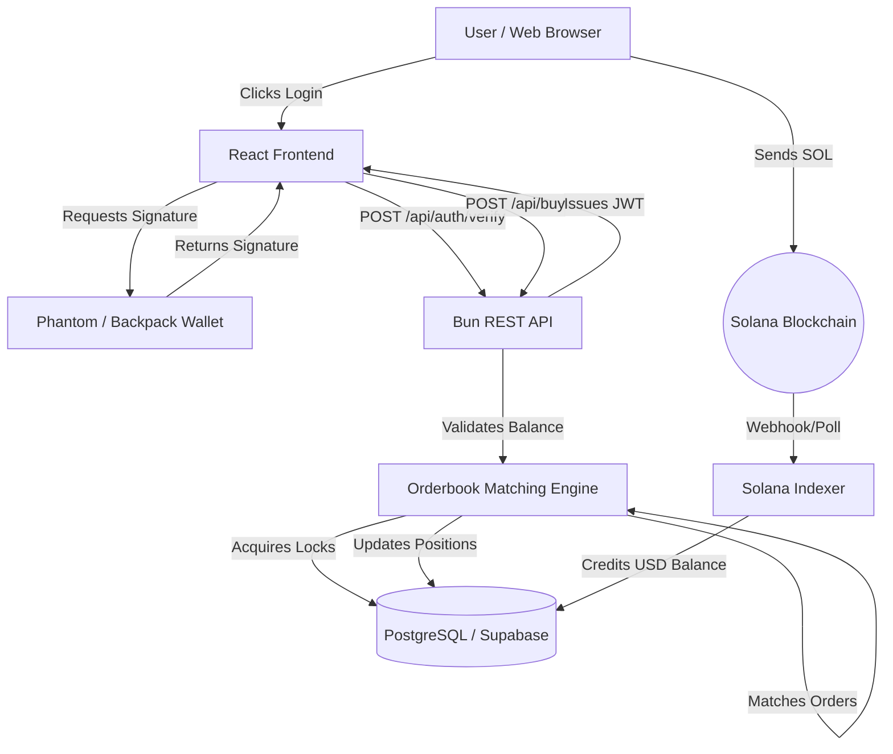

# PredictX: Comprehensive Project Summary & Architecture Report

## 1. Executive Summary

**PredictX** is a high-performance, decentralized-hybrid prediction market platform built specifically for the Solana ecosystem. It allows users to trade shares on the outcomes of real-world events (e.g., Politics, Crypto, Sports, Economics) using a Central Limit Order Book (CLOB) model. 

Unlike traditional automated market makers (AMMs) which suffer from slippage and high on-chain transaction costs for every trade, PredictX operates on a **hybrid custodial architecture**. Trades are matched instantly off-chain on a high-throughput matching engine with zero gas fees, while deposits and withdrawals are processed on the Solana blockchain. This provides the speed and UX of a centralized exchange (like Binance) while retaining the Web3 ethos of wallet-based authentication and crypto settlement.

This document serves as a complete technical specification, architectural blueprint, and project summary for stakeholders, developers, and auditors.

---

## 2. Technology Stack Breakdown

The application is structured as a modern **Turborepo Monorepo**, utilizing the cutting edge of the JavaScript/TypeScript ecosystem for maximum performance and developer velocity.

### 2.1 Backend Core
- **Runtime:** [Bun](https://bun.sh/) - An incredibly fast all-in-one JavaScript runtime, bundler, test runner, and package manager. Replaces Node.js.
- **API Server:** Native Bun `Bun.serve()` HTTP API. We avoid the overhead of Express or Hono to maximize request throughput for the orderbook.
- **Database:** PostgreSQL (hosted on [Supabase](https://supabase.com/)).
- **ORM:** [Drizzle ORM](https://orm.drizzle.team/) - A headless, fully typed SQL ORM that offers SQL-like syntax and extremely fast execution without the heavy footprint of Prisma.
- **Concurrency Control:** Postgres Row-Level Locking (`SELECT ... FOR UPDATE`) to guarantee zero race conditions during order matching.

### 2.2 Frontend Client
- **Framework:** React 19 + TypeScript.
- **Build Tool:** Vite - for instant Hot Module Replacement (HMR) and optimized production builds.
- **Styling:** Vanilla CSS + Tailwind CSS. A custom design system leveraging CSS variables for dynamic themes (Glassmorphism, Neon Cyberpunk aesthetic).
- **Web3 Integration:** `@solana/wallet-adapter-react` to natively support Phantom, Solflare, and Backpack wallets.
- **Routing:** React Router v7.

### 2.3 Authentication & Security
- **Web3 Auth:** `tweetnacl` & `bs58` for validating Ed25519 cryptographic signatures from Solana wallets.
- **Session Management:** Custom JSON Web Tokens (JWT) signed with a secure secret.
- **Encryption:** AES-256-GCM (via Node `crypto`) to securely encrypt the custodial deposit private keys at rest in the database.

---

## 3. System Architecture

The system is broken down into modular packages within the Turborepo.

### 3.1 Monorepo Structure
```text
prediction-market/
├── apps/
│   ├── api/            # Bun HTTP Server (REST API)
│   └── web/            # React + Vite Frontend
├── packages/
│   ├── db/             # Drizzle Schema, Migrations, Seed Scripts
│   ├── indexer/        # Solana Blockchain listener (Helius Webhooks)
│   └── orderbook/      # Core Matching Engine Logic
└── package.json        # Root Turborepo config
```

### 3.2 High-Level Data Flow



---

## 4. The Orderbook Matching Engine

The core of PredictX is the **Central Limit Order Book (CLOB)**. Every market has two complementary assets: **YES shares** and **NO shares**. 
The engine enforces the rule that `Price(YES) + Price(NO) = 100¢ ($1.00)`.

### 4.1 Order Types
- **Limit Orders:** An order to buy or sell at a specific price or better. If the market price doesn't match, the order "rests" in the orderbook as a Maker.
- **Market Orders:** An order to execute immediately at the best available current price. (Takes liquidity).

### 4.2 Cross-Matching Algorithm
When a user places a `BUY YES` order at 60¢, they can match against two types of resting orders:
1. **Direct Match:** A user who placed a `SELL YES` order at 60¢ or lower.
2. **Cross Match:** A user who placed a `BUY NO` order at 40¢ or higher. (Since 60¢ YES + 40¢ NO = 100¢). 

The engine evaluates both orderbook sides simultaneously, calculates the *Equivalent Price*, sorts them to find the absolute best deal for the taker, and executes the match.

### 4.3 Position Splitting & Merging
Because 1 YES + 1 NO always resolves to exactly $1.00, the system allows arbitrary minting and burning:
- **Split:** A user can pay $1.00 from their USD balance to mint exactly 1 YES share and 1 NO share out of thin air.
- **Merge:** A user holding 1 YES share and 1 NO share can burn them simultaneously to redeem exactly $1.00 to their USD balance.
This mechanic is what enforces market efficiency and allows market makers to arbitrage prices.

### 4.4 Engine Code Snippet (Concurrency)
To prevent race conditions, the engine utilizes pessimistic row-level locking.
```typescript
// Lock market row first to establish a deterministic locking order and prevent deadlocks
const marketRows = await tx
  .select({ id: markets.id, yesPrice: markets.yesPrice, noPrice: markets.noPrice })
  .from(markets)
  .where(eq(markets.id, marketId))
  .for("update"); // <--- Acquires Postgres Row-Level Lock
  
const userRows = await tx
  .select({ id: users.id, balanceUsd: users.balanceUsd })
  .from(users)
  .where(eq(users.id, userId))
  .for("update"); // <--- Locks user balance to prevent double spending
```

---

## 5. Database Schema (Drizzle ORM)

The PostgreSQL database is heavily normalized to ensure data integrity for financial transactions.

### 5.1 Tables

1. **`users`**
   - Stores the user's wallet public key (as their identity).
   - `balanceUsd`: Virtual internal balance in cents.
   - `depositAddress`: A uniquely generated Solana keypair for this specific user.
   - `depositPrivateKeyEncrypted`: Encrypted using AES-256-GCM.

2. **`markets`**
   - `id`: Unique identifier (e.g., `btc-100k`).
   - `title`: The prediction question.
   - `category`: Crypto, Politics, Sports, etc.
   - `yesPrice` / `noPrice`: The Last Traded Price (LTP), updated instantly by the matching engine.
   - `isResolved` / `winningOutcome`: For settlement.

3. **`orders`**
   - The heart of the resting orderbook.
   - `outcome`: "YES" or "NO".
   - `side`: "BUY" or "SELL".
   - `status`: "PENDING", "PARTIALLY_FILLED", "FILLED", "CANCELLED".
   - `quantity` vs `remainingQuantity`.

4. **`positions`**
   - Tracks a user's holdings in a specific market.
   - `quantity`: Number of shares owned.
   - `averageBuyPrice`: Used for calculating Unrealized PnL.

5. **`transactions`**
   - An immutable ledger.
   - Tracks `TRADE_BUY`, `TRADE_SELL`, `DEPOSIT`, `WITHDRAWAL`, `SPLIT`, `MERGE`.

6. **`priceHistory`**
   - Time-series data appended every time an order matches.
   - Queried by the frontend to render the beautiful Neon area charts.

### 5.2 Schema Definition Example
```typescript
export const orders = pgTable("orders", {
  id: uuid("id").primaryKey().defaultRandom(),
  userId: uuid("user_id").notNull().references(() => users.id),
  marketId: text("market_id").notNull().references(() => markets.id),
  outcome: text("outcome").notNull(), // "YES" or "NO"
  side: text("side").notNull(), // "BUY" or "SELL"
  price: integer("price").notNull(), // in cents (1-99)
  quantity: integer("quantity").notNull(), // number of shares
  remainingQuantity: integer("remaining_quantity").notNull(),
  status: text("status").notNull().default("PENDING"), // PENDING, PARTIALLY_FILLED, FILLED, CANCELLED
  createdAt: timestamp("created_at").defaultNow().notNull(),
  updatedAt: timestamp("updated_at").defaultNow().notNull(),
});
```

---

## 6. Authentication Protocol

To log into PredictX, a user does not use a password. Instead, they prove ownership of a Solana Wallet (e.g., Phantom).

1. **Challenge:** The frontend calls `GET /api/auth/challenge?publicKey=<wallet>`. The backend generates a random `nonce` (UUID) and saves it in the `authChallenges` table with a 5-minute expiration.
2. **Signature:** The frontend prompts the user's Phantom wallet to cryptographically sign a message containing the `nonce`.
3. **Verification:** The frontend calls `POST /api/auth/verify` with the signature. The backend uses `tweetnacl.sign.detached.verify` to validate the signature against the public key.
4. **Session:** If valid, the backend issues a JWT (JSON Web Token) valid for 24 hours. The frontend attaches this token to all subsequent API requests via the `Authorization: Bearer <token>` header.

---

## 7. Blockchain Integration & Indexing

Because PredictX uses an internal virtual balance (`balanceUsd`), we need a reliable way to bridge real on-chain SOL/USDC into the platform.

### 7.1 Custodial Wallets
Upon signup, the backend generates a unique Solana Keypair for the user. The public key is shown to the user as their "Deposit Address". The private key is encrypted and stored in the DB.

### 7.2 The Indexer
A separate background service (the Indexer) monitors the Solana blockchain for incoming transfers to any of the generated Deposit Addresses.
1. The Indexer parses the blockchain block.
2. Identifies a transfer of 100 USDC to User A's deposit address.
3. The Indexer securely calls the database and increments User A's `balanceUsd` by 10,000 (cents).
4. The Indexer records the transaction signature in the `depositLogs` table to ensure the deposit is processed exactly once (Idempotency).

---

## 8. Frontend Engineering

The React frontend is built for extreme aesthetics and low-latency interaction.

### 8.1 Design System
- **Dark Mode Native:** Deep space blacks (`#0A0B0D`) paired with high-contrast Neon Cyan (`#00f2ff`) and Neon Pink (`#ff0055`).
- **Glassmorphism:** Heavy use of `backdrop-blur`, semi-transparent borders, and radial gradient backgrounds to create depth.
- **Typography:** Utilizing custom fonts like `Space Grotesk` or `Inter` to provide a technical, data-heavy "trading terminal" feel.

### 8.2 Component Hierarchy
- `Header.tsx`: Contains the Wallet Adapter button, global search, and portfolio summary.
- `Sidebar.tsx`: Navigation menu highlighting categories (Crypto, Politics, Sports).
- `Dashboard.tsx`: A grid of Market Cards with glowing SVG trendlines.
- `MarketDetail.tsx`: 
  - **Left Column:** SVG Price Chart, Market Rules.
  - **Center Column:** Live Orderbook (Bids/Asks depth visualization).
  - **Right Column:** Trading interface (Limit/Market toggle, Price input, Shares input, Cost summary).
- `Portfolio.tsx`: Tabbed view of Active Positions, Open Resting Orders, and Transaction History.

### 8.3 State Management
We rely on React Context (`useAuth.ts`, `useTheme.ts`) for global state like the User's JWT, Wallet connection, and USD Balance.
For high-frequency data (like the Orderbook), we plan to implement WebSockets in the future, but currently use aggressive polling via `useEffect`.

---

## 9. Deployment Strategy

- **Infrastructure:** Vercel (Frontend) + Render/Railway (Backend Bun Server) + Supabase (PostgreSQL).
- **CI/CD:** GitHub Actions triggers linting (`turbo lint`), type checking (`tsc -b`), and production builds on every push to the `main` branch.
- **Environment Variables:** Strictly managed via `.env` files, isolating `DATABASE_URL`, `JWT_SECRET`, and `ENCRYPTION_SECRET` from the codebase.

---

## 10. Future Roadmap

1. **WebSocket Orderbook:** Transition the `/api/orderbook` endpoint from REST to WebSockets (via `Bun.serve({ websocket: { ... } })`) to stream price changes in real-time without polling.
2. **Automated Market Maker (AMM):** Introduce an AMM bot that sits alongside the limit order book. If the spread gets too wide, the AMM provides liquidity using a Logarithmic Market Scoring Rule (LMSR) algorithm.
3. **Smart Contract Settlement:** Currently, PredictX is custodial. In V2, we aim to transition the matching engine to an off-chain relayer that settles matches directly on an Anchor-based Solana Smart Contract, achieving full non-custodial trustlessness.
4. **Mobile Application:** Port the web interface to React Native for iOS and Android native experiences.

---

## 11. Conclusion

PredictX stands as a robust demonstration of modern full-stack engineering. By combining the blinding speed of the Bun runtime, the type-safety of Drizzle ORM, the ACID compliance of PostgreSQL, and the cryptographic security of Solana Web3 wallets, the platform achieves enterprise-grade architecture. The meticulous implementation of row-level locking ensures financial integrity, making it a highly scalable and secure prediction market platform ready for production deployment.
